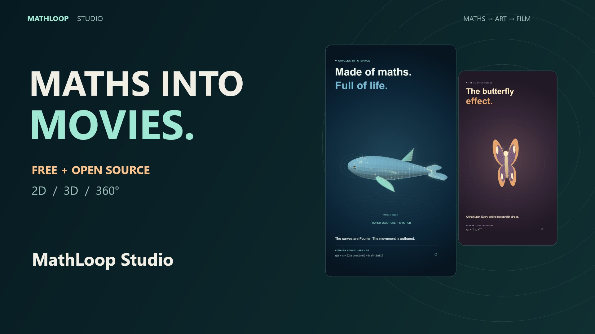
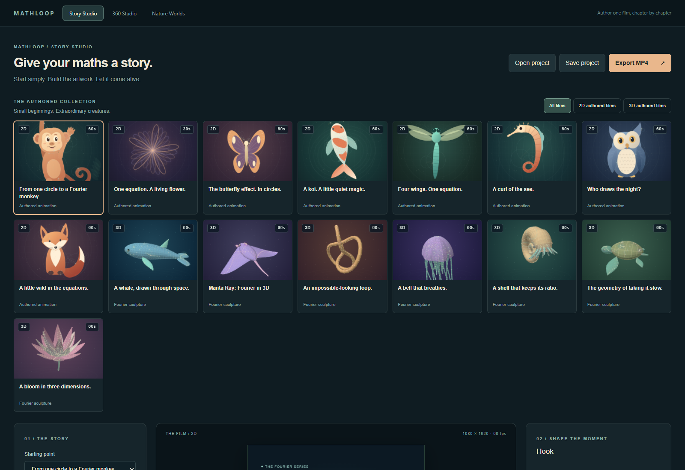
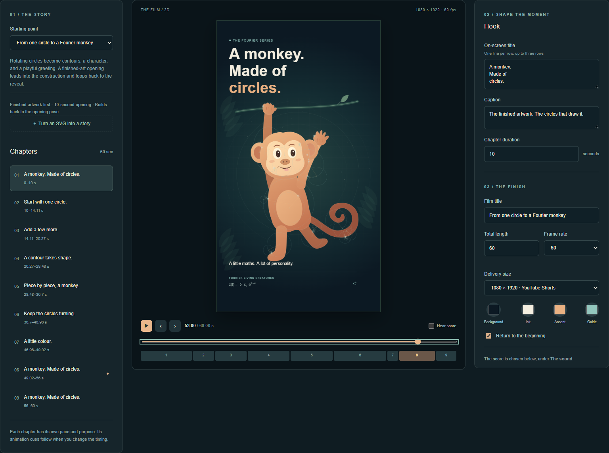
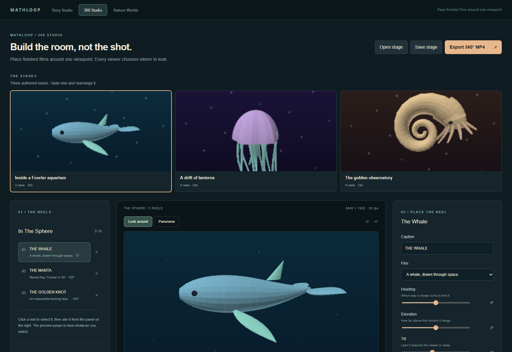
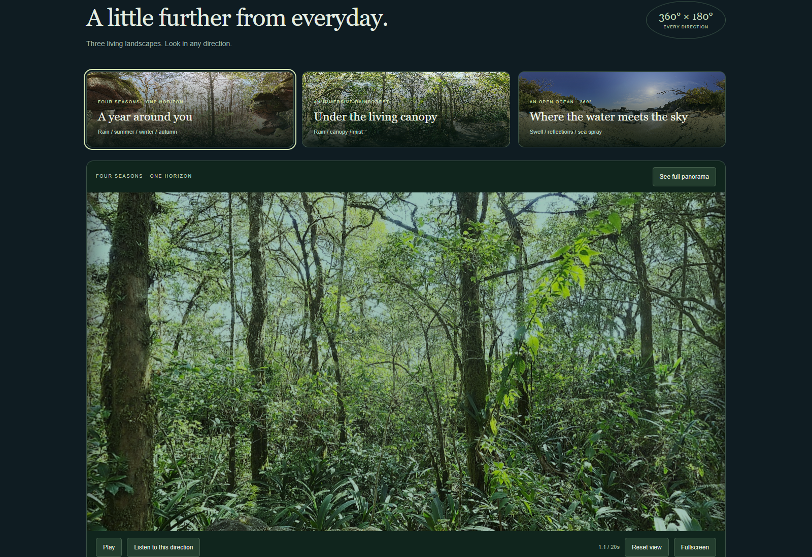

# MathLoop Studio

**Turn maths into movies.** Create animated Fourier art, edit a story, add a
procedural soundtrack, and export a film — or build an entire 360° world.



[Download videos & launch trailer](https://github.com/ravipurohit1991/MathLoop-Studio/releases/latest)
· [Quick start](#quick-start) · [Authoring guide](docs/story-authoring.md)
· [360° guide](docs/360-video.md) · [MIT license](LICENSE)

MathLoop Studio is a local creative coding toolkit and browser editor. Start
with a finished film, change its chapters and look, then render your own edition.
No account or API key is required. Artwork and music are generated from source;
the Nature Worlds photography ships with the project.

## What you can make

| Workspace | Create | Deliver |
| --- | --- | --- |
| **Story Studio** | 2D Fourier drawings and 3D sculptures with editable chapters, captions, colours, camera settings and music | Portrait MP4s and saved project JSON |
| **360 Studio** | Arrange 3D reels around a viewpoint; aim, scale, tint and preview them | Spherical MP4s with projection metadata, plus guided 9:16 companion films |
| **Nature Worlds** | Photographic rainforest, ocean and four-season environments with weather and directional ambience | 360° films; native delivery includes four-channel spatial audio |

- **15 authored films:** eight in 2D and seven in 3D. Monkey, butterfly, koi,
  owl, whale, manta, jellyfish, lotus and more.
- **Three 360° stages:** Fourier aquarium, lanterns and golden observatory.
- **Eight original scores:** including Still Water, Aurora Glass, Driftwood
  and Whale Song. Synthesized around the edit's timing.
- **SVG import:** sample an outline and reconstruct it with rotating circles.
  Geometry is processed locally and embedded in the saved project.
- **Reproducible animation:** seeking and rendering evaluate the same timeline.
  Chapter-relative cues follow changes to chapter lengths.
- **Browser and CLI exports:** edit interactively or batch-render the collection.

## Quick start

Install **Node.js 22 or newer** and Git, then:

```sh
git clone https://github.com/ravipurohit1991/MathLoop-Studio.git
cd MathLoop-Studio
npm ci
npm run dev
```

Open **http://127.0.0.1:5180**. Choose a film in Story Studio, edit a chapter,
scrub the timeline, choose a score, and click **Export MP4**. Use **Save project**
to download an editable JSON copy; autosave is only local to that browser.

Use a recent Chrome or Edge for browser video export. WebCodecs availability
depends on the browser, operating system and audio channel count. Nature Worlds
needs WebGL. Native CLI rendering additionally requires **FFmpeg and ffprobe on
PATH**, and the optional `@napi-rs/canvas` dependency installed by `npm ci`.

```sh
ffmpeg -version
ffprobe -version
npm run build
npm run preview
```

The production build is written to `dist-studio/`; preview prints its local URL.

## See the studios

### Story Studio

Choose an authored film, edit its chapters, and export with sound.





### 360 Studio

Place finished 3D reels around the viewer. Switch between a look-around view
and the 2:1 export panorama.



### Nature Worlds

Photographic environments with procedural weather and directional listening.



## Render from the terminal

```sh
# Discover the films and scores
npm run story -- --list
npm run story -- --scores

# Fast review: stills, contact sheet, score and saved edit
npm run story:preview -- --story fourier-whale-3d --width 540

# Full portrait film, with sound
npm run story:render -- --story fourier-whale-3d

# Render a saved edit, or change its length and score
npm run story:render -- --project projects/fourier-whale-shorts.story.json
npm run story:render -- --story fourier-koi --duration 30 --score deep-current

# All 14 showcase films (polar rose is outside this collection)
npm run collection

# A 360° film and its separately rendered portrait companion
npm run 360:render
npm run 360:short
npm run 360:preview

# Photographic 360° environment with native spatial audio encoding
npm run nature:render -- --world jungle --width 3840 --duration 20
```

Single-story delivery defaults to 1080 × 1920, 60 fps, two temporal samples,
H.264 video and AAC stereo audio. The showcase batch defaults to 30 fps.
The aquarium defaults to a 20-second, 3840 × 1920, 30 fps spherical film.
Exports are written under **`out/`**, intentionally excluded from Git.

Native story exports include an MP4, cover, chapter contact sheet, score WAV,
editable JSON and verification manifest. Render speed depends on resolution,
sampling and scene complexity; exports are offline renders.

Spherical MP4s contain projection metadata. Portrait companions are regular
videos with a guided camera. Ordinary Story/360 Studio exports use stereo
audio. Four-channel spatial AAC is not supported by every browser encoder; use
the native Nature Worlds command or [spatial audio workflow](docs/360-audio.md)
when needed. Actual YouTube 360° playback must be checked after upload.

## How the code works

```js
// Inside this checkout, the package resolves its own "mathloop" name.
import { getStory, createStoryEngine } from 'mathloop';

const story = getStory('fourier-whale-3d');
const canvas = document.querySelector('canvas');
const engine = createStoryEngine({ canvas, story });

engine.renderAt(12.5); // Render any point on the timeline.
engine.dispose();
```

A story defines chapters, animation tracks, artwork, theme and audio settings.
The engine evaluates those at a given time. The 2D renderer reconstructs contours
from complex Fourier coefficients; 3D films reconstruct XYZ curves and join
neighbouring contours into shaded surfaces. This is a spatial Fourier series,
not a spherical-harmonic surface model.

| Location | Responsibility |
| --- | --- |
| `studio/` | React editors, SVG import, score audition |
| `src/math/` | Sampling, contours and Fourier transforms |
| `src/story/` | Chapters, tracks, projects, Canvas renderers and eight scores |
| `src/stories/` | Authored 2D/3D films and 360° stages |
| `src/nature/` | WebGL nature environments and synthesized ambience |
| `src/export/` | Browser encoding and spherical metadata |
| `src/node/`, `cli/` | Native rendering, local players and batch commands |
| `projects/`, `examples/` | Saved edits and starter definitions |
| `marketing/` | Launch script, publishing copy and trailer instructions |

Start with [story authoring](docs/story-authoring.md), the
[2D example](examples/spiral-story.js), or the [3D example](examples/spatial-story.js).
The [whale Shorts recipe](recipes/fourier-whale-shorts.md) covers the 60-second
whale edition and its synchronized synthesized calls.

## Development checks

```sh
npm test
npm run build
npm run test:studio
npm run test:studio-360
npm run test:nature
```

Core tests cover timeline edits, Fourier reconstruction, deterministic seeking,
loop boundaries, audio, cancellation and spherical metadata. Browser tests use
Playwright with installed Edge on Windows; elsewhere install Chromium with
`npx playwright install chromium`. Story/360 tests also accept the
`MATHLOOP_BROWSER` environment variable. Browser export tests need actual codec
support; a headless Chromium build may lack AAC encoding.

Contributions are welcome: new creatures, scores, authoring improvements and
small reproducible bug reports. Include the saved project and browser/OS when
reporting an export issue, after removing any private content.

## License and credits

Code is [MIT licensed](LICENSE). Nature photographs come from **Poly Haven**
under CC0; photographers and source links are retained in
[the asset manifest](assets/nature/sources.json) and
[third-party notices](THIRD_PARTY_NOTICES.md). The launch narration is synthetic.

If you make a film with MathLoop Studio, a repository link in your description
helps other creators find it. Stars, experiments and new stories are welcome.
