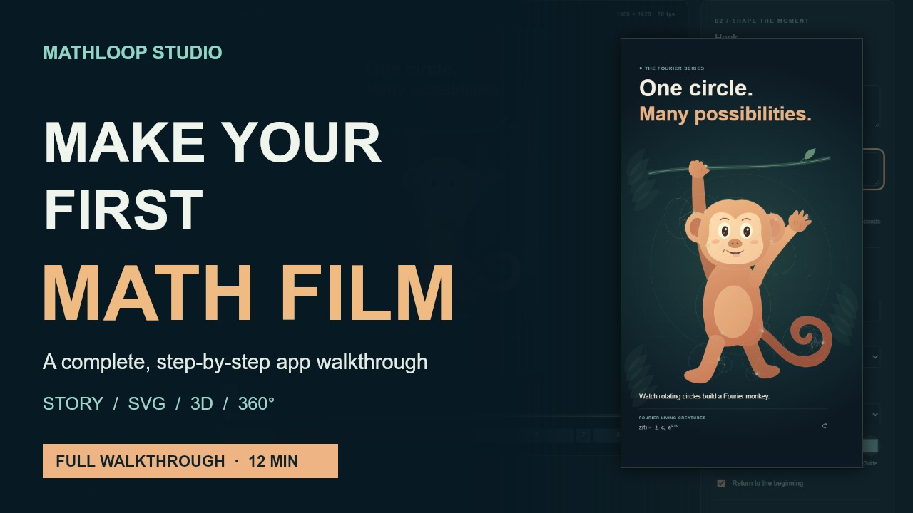

# Follow the complete walkthrough

The narrated walkthrough follows one real edit from the starting film through
saving, reopening and exporting it. It then introduces SVG artwork, 3D films,
360° arrangements and Nature Worlds.

Download the walkthrough and example files from the
[walkthrough release](https://github.com/ravipurohit1991/MathLoop-Studio/releases/tag/v0.1.2).
The [transcript](../marketing/walkthrough-transcript.md) is also available in the repository.

[](https://github.com/ravipurohit1991/MathLoop-Studio/releases/tag/v0.1.2)

## Make the example film

1. Follow the [quick start](../README.md#quick-start), then open Story Studio.
2. Choose **From one circle to a Fourier monkey**.
3. Select its first chapter. Set the title to two lines: `One circle.` and
   `Many possibilities.`. Set the caption to
   `Watch rotating circles build a Fourier monkey.`.
4. Change that chapter to **4 seconds**, then set the film's **Total length** to
   **20 seconds**. Changing total length rescales all chapter durations, including
   the opening you just edited.
5. Set **Film title** to `My first Fourier film`, **Frame rate** to **24**, and
   **Delivery size** to **540 × 960** for a small review export.
6. Set the accent colour to `#e68938`. Choose **Still Water** and set **Score volume**
   to **35%**.
7. Scrub and play the preview. Use **Save project**, then **Open project** to reopen
   the downloaded JSON and check your saved edit.
8. Choose **Export MP4** and watch the downloaded file. Select **1080 × 1920**
   when you want a larger portrait deliverable.

The [editable example](../examples/my-first-film.story.json) is also in the
repository. The release includes `my-first-film.story.json` and the actual browser-exported
`my-first-film.mp4`. The tutorial shortens the export waiting interval.

## Try the other workflows

- **SVG:** Save your current edit, then import
  [walkthrough-leaf.svg](../examples/walkthrough-leaf.svg). Scrub to the finished
  outline and rewrite its chapters. Imported geometry is stored in the project.
- **3D:** Choose the whale. Compare rotating-circle and sphere-cage guides,
  toggle the surface mesh, and change the camera yaw. Inspect the preview after
  changing each setting.
- **Animation tracks:** Open the optional JSON editor. A cue addresses a chapter
  and a progress value from 0 to 1; see the [authoring guide](story-authoring.md).
- **360 Studio:** Open the aquarium, add a reel, and adjust heading, elevation,
  size and distance. Select the reel to face it. Compare Look around and Panorama.
  Save the stage, then choose spherical or portrait-companion export. The
  [saved example stage](../examples/my-aquarium.stage.json) includes the extra reel.
- **Nature Worlds:** Compare the three worlds, direction cards, weather intensity,
  loop duration and panorama resolution. Directional preview and spatial playback
  have different listening behaviour; see the [360° guide](360-video.md).

## Keep the three kinds of files distinct

| File | Purpose |
| --- | --- |
| Project or stage JSON | Editable recipe; reopen it in the corresponding studio |
| Portrait MP4 | Ordinary fixed-camera video, suitable for a vertical feed |
| Spherical MP4 | Complete 2:1 frame plus projection metadata; view with a 360° player |

The walkthrough itself is a conventional landscape video. The release links to
separate spherical sample files for interactive viewing.

## Rebuild the tutorial

These optional marketing tools do not affect the app runtime. They require the
repository's optional Playwright and canvas dependencies, FFmpeg, ffprobe, Python
and `uv`. On Windows they use installed Edge; set `MATHLOOP_BROWSER` to another
installed Playwright browser channel if needed.

```sh
uv run cli/narrate-walkthrough.py
node cli/capture-walkthrough.mjs
node cli/render-walkthrough.mjs
node cli/package-walkthrough.mjs
```

The narration helper sends the public script to Microsoft's Edge speech service.
It caches each clip by text and voice, and keeps the natural speaking rate.
Capture uses a fresh browser profile and downloads only the tutorial's own files.
The two aquarium comparison clips are the existing sample files from the earlier
launch release; place them at the paths documented in `capture-walkthrough.mjs`
before capturing the comparison card.

Source script and planned interactions: [walkthrough.json](../marketing/walkthrough.json).
Generated captures, media and upload files live under ignored `out/walkthrough/`.
To resume a capture, use `--from=scene-id`; to retry specific scenes, use
`--only=scene-id,scene-id`. The previous scene's saved browser state restores the
tutorial's project. Render individual scenes with `--only=scene-id`.

Narration is mixed to a single centred signal. No delay or reverb is applied.
The exported-film listening interval includes the app's actual soundtrack.
